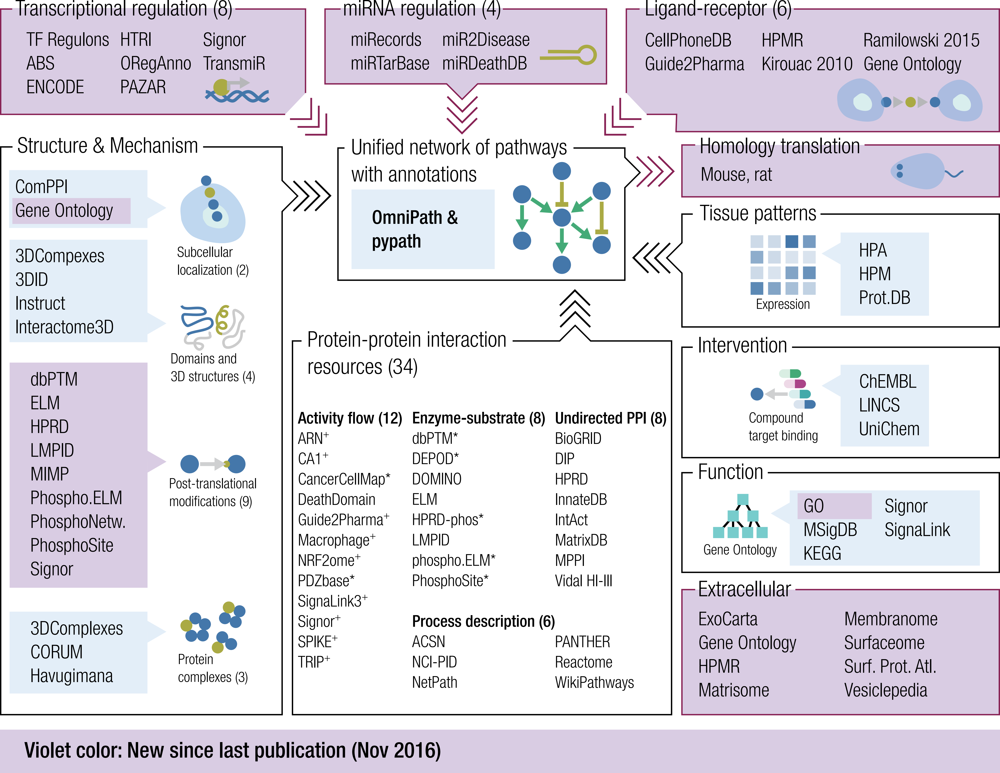

# Introduction

`r BiocStyle::Biocpkg("OmnipathR")` is an _R_ package built to provide easy access to
the data stored in the OmniPath webservice [@Turei2016]:

<http://omnipathdb.org/>

The webservice implements a very simple REST style API. This package make
requests by the HTTP protocol to retreive the data. Hence, fast Internet
access is required for a proper use of `r BiocStyle::Biocpkg("OmnipathR")`.

## Query types

`r BiocStyle::Biocpkg("OmnipathR")` can retrieve five different types of data:

* **Interactions**: protein-protein interactions organized in different
datasets:
    + **omnipath**: the OmniPath data as defined in the original
    publication [@Turei2016] and collected from different databases.
    + **pathwayextra**: activity flow interactions without literature
    reference.
    + **kinaseextra**: enzyme-substrate interactions without literature
    reference.
    + **ligrecextra**: ligand-receptor interactions without literature
    reference.
    + **tfregulons**: transcription factor (TF)-target interactions from
    **DoRothEA** [@GarciaAlonso2019].
    + **tf-miRNA**: transcription factor-miRNA interactions
    + **miRNA-target**: miRNA-mRNA interactions.
    + **lncRNA-mRNA**: lncRNA-mRNA interactions.
    + **small molecule-protein**: interactions between small molecules
    (metabolites, intrinsic ligands, drug compounds) and proteins.


* **Post-translational modifications (PTMs)**: It provides
enzyme-substrate reactions in a very similar way to the aforementioned
interactions. Some of the biological databases related to PTMs integrated
in OmniPath are Phospho.ELM [@Dinkel2010] and PhosphoSitePlus
[@Hornbeck2014}.

* **Complexes**: it provides access to a comprehensive database of more than
22000 protein complexes. This data comes from different resources
such as: CORUM [@Giurgiu2018] or Hu.map [@Drew2017].

* **Annotations**: it provides a large variety of data regarding
different annotations about proteins and complexes. These data come from
dozens of databases covering different topics such as: The Topology Data Bank
of Transmembrane Proteins (TOPDB) [@Dobson2014] or ExoCarta
[@Keerthikumar2016], a database collecting the proteins that were identified
in exosomes in multiple organisms.

* **Intercell**: it provides information on the roles in
inter-cellular signaling. For instance. if a protein is a ligand, a receptor,
an extracellular matrix  (ECM) component, etc. The data does not come from
original sources but combined from several databases by us. The source
databases, such as CellPhoneDB [@VentoTormo2018] or Receptome
[@BenShlomo2003], are also referred for each reacord.

Figure \@ref(fig:fig1) shows an overview of the resources featured in
**OmniPath**. For more detailed information about the original data sources
integrated in Omnipath, please visit:

+ <http://omnipathdb.org/>
+ <http://omnipathdb.org/info>

```{r fig1, fig.cap="Overview of the resources featured in OmniPath. Causal resources (including activity-flow and enzyme-substrate resources) can provide direction (*) or sign and direction (+) of interactions.", echo=FALSE}
library(knitr)

```


## Mouse and rat
Excluding the miRNA interactions, all interactions and PTMs are available for
human, mouse and rat. The rodent data has been translated from human using the
NCBI Homologene database. Many human proteins do not have known homolog in
rodents, hence rodent datasets are smaller than their human counterparts.

In case you work with mouse omics data you might do better to translate your
dataset to human (for example using the pypath.homology module,
<https://github.com/saezlab/pypath/>) and use human interaction data.

# Installation of the `r BiocStyle::Biocpkg("OmnipathR")` package

First of all, you need a current version of _R_. `r BiocStyle::Biocpkg("OmnipathR")`
is a freely available package deposited on _Bioconductor_ and
[GitHub](https://github.com/saezlab/OmnipathR). You can install it by running
the following commands on an _R_ console:

```{r installation, eval=FALSE}
if (!requireNamespace("BiocManager", quietly = TRUE))
    install.packages("BiocManager")

BiocManager::install("OmnipathR")
```

We also load here the required packages to run the code in this vignette.

```{r libraries, message=FALSE}
library(OmnipathR)
library(tidyr)
library(dnet)
library(gprofiler2)
```

# Usage Examples
In the following paragraphs, we provide some examples to describe how to use
the `r BiocStyle::Biocpkg("OmnipathR")` package to retrieve different types of
information from **Omnipath** webserver. In addition, we play around with the
data aiming at obtaining some biological relevant information.

Noteworthy, the sections **complexes**, **annotations** and **intercell** are
linked. We explore the annotations and roles in inter-cellular communications
of the proteins involved in a given complex. This basic example shows the
usefulness of integrating the information available in the different
**Omnipath** resources.

## Interactions

Proteins interact among them and with other biological molecules to perform
cellular functions. Proteins also participates in pathways, linked series of
reactions occurring inter/intra cells to transform products or to transmit
signals inducing specific cellular responses. Protein interactions are
therefore a very valuable source of information to understand cellular
functioning.

We here download the original **OmniPath** human interactions [@Turei2016].
To do so, we first check the different source databases and select some of
them. Then, we print some of the downloaded interactions ("+" means
activation, "-" means inhibition and "?" means undirected interactions or
inconclusive data).

```{r interactions}
## We check some of the different interaction databases
get_interaction_resources()

## The interactions are stored into a data frame.
interactions <-
    import_omnipath_interactions(resources=c("SignaLink3","PhosphoSite",
    "SIGNOR"))

## We visualize the first interactions in the data frame.
print_interactions(head(interactions))
```

### Protein-protein interaction networks

Protein-protein interactions are usually converted into networks. Describing
protein interactions as networks not only provides a convenient format for
visualization, but also allows applying graph theory methods to mine the
biological information they contain.

We convert here our set of interactions to a network/graph
(`r BiocStyle::CRANpkg("igraph")`object). Then, we apply two very common approaches to
extract information from a biological network:

+ **Shortest Paths**: finding a path between two nodes (proteins) going
through the minimum number of edges. This can be very useful to track
consecutive reactions within a given pathway. We display below the shortest
path between two given proteins and all the possible shortests paths between
two other proteins. It is to note that the functions `print_path\_es` and
`print_path\_vs` display very similar results, but the first one takes as an
input an edge sequence and the second one a node sequence.

```{r sp, message=TRUE}
## We transform the interactions data frame into a graph
OPI_g <- interaction_graph(interactions = interactions)

## Find and print shortest paths on the directed network between proteins
## of interest:
print_path_es(shortest_paths(OPI_g,from = "TYRO3",to = "STAT3",
    output = 'epath')$epath[[1]],OPI_g)

## Find and print all shortest paths between proteins of interest:
print_path_vs(all_shortest_paths(OPI_g,from = "DYRK2",
    to = "MAPKAPK2")$res,OPI_g)
```


+ **Clustering**: grouping nodes (proteins) in such a way that nodes belonging
to the same group (called cluster) are more connected in the network to each
other than to those in other groups (clusters). Since proteins interact to
perform their functions, proteins within the same cluster are likely to be
implicated in similar biological tasks. Figure \@ref(fig:fig2) shows the
subgraph containing the proteins and interactions of a specifc protein, ERBB2
The `r BiocStyle::CRANpkg("igraph")` package contains functions to apply sevaral
different cluster methods on graphs (visit <https://igraph.org/r/doc/> for
detailed information.)

```{r clustering, message=FALSE}
## We apply a clustering algorithm (Louvain) to group proteins in
## our network. We apply here Louvain which is fast but can only run
## on undirected graphs. Other clustering algorithms can deal with
## directed networks but with longer computational times,
## such as cluster_edge_betweenness. These cluster methods are directly
## available in the igraph package.
OPI_g_undirected <- as.undirected(OPI_g, mode=c("mutual"))
OPI_g_undirected <- simplify(OPI_g_undirected)
cl_results <- cluster_fast_greedy(OPI_g_undirected)
## We extract the cluster where a protein of interest is contained
cluster_id <- cl_results$membership[which(cl_results$names == "ERBB2")]
module_graph <- induced_subgraph(OPI_g_undirected,
    V(OPI_g)$name[which(cl_results$membership == cluster_id)])
```

```{r fig2, echo = FALSE, fig.cap="ERBB2 associated cluser. Subnetwork extracted from the interactions graph representing the cluster where we can find the gene *ERBB2* (yellow node)"}
## We print that cluster with its interactions.
par(mar=c(0.1,0.1,0.1,0.1))
plot(module_graph, vertex.label.color="black",vertex.frame.color="#ffffff",
    vertex.size= 15, edge.curved=.2,
    vertex.color = ifelse(igraph::V(module_graph)$name == "ERBB2","yellow",
    "#00CCFF"), edge.color="blue",edge.width=0.8)
```

## Other interaction datasets

We used above the interactions from the dataset described in the original
**OmniPath** publication [@Turei2016]. In this section, we provide
examples on how to retry and deal with interactions from the remaining
datasets. The same functions can been applied to every interaction dataset.

### Pathway Extra

In the first example, we are going to get the interactions from the
**pathwayextra** dataset, which contains activity flow interactions
without literature reference. We are going to focus on the mouse interactions
for a given gene in this particular case.

```{r pathwayextra}
## We query and store the interactions into a dataframe
interactions <-
    import_pathwayextra_interactions(resources=c("BioGRID","STRING"),
    organism = 10090)

## We select all the interactions in which Amfr gene is involved
interactions_Amfr <- dplyr::filter(interactions, source_genesymbol == "Amfr" |
    target_genesymbol == "Amfr")

## We print these interactions:
print_interactions(interactions_Amfr)
```

### Kinase Extra

Next, we download the interactions from the **kinaseextra** dataset, which
contains enzyme-substrate interactions without literature reference. We are
going to focus on rat reactions targeting a particular gene.

```{r kinaseextra}
## We query and store the interactions into a dataframe
interactions <-
    import_kinaseextra_interactions(resources=c("PhosphoPoint",
    "PhosphoSite"), organism = 10116)

## We select the interactions in which Dpysl2 gene is a target
interactions_TargetDpysl2 <- dplyr::filter(interactions,
    target_genesymbol == "Dpysl2")

## We print these interactions:
print_interactions(interactions_TargetDpysl2)
```

### Ligand-receptor Extra

In the following example we are going to work with the **ligrecextra**
dataset, which contains ligand-receptor interactions without literature
reference. Our goal is to find the potential receptors associated to a given
ligand, CDH1 (Figure \@ref(fig:fig3)).

```{r ligrecextra}
## We query and store the interactions into a dataframe
interactions <- import_ligrecextra_interactions(resources=c("iTALK",
    "Baccin2019"), organism=9606)

## Receptors of the CDH1 ligand.
interactions_ADM2 <- dplyr::filter(interactions, source_genesymbol == "ADM2")

## We transform the interactions data frame into a graph
OPI_g <- interaction_graph(interactions = interactions_ADM2)

## We induce a network with these genes
Induced_Network <-  dNetInduce(g=OPI_g,
    nodes_query=as.character( V(OPI_g)$name), knn=0,
    remove.loops=FALSE, largest.comp=FALSE)
```

```{r fig3, echo = FALSE, fig.cap="Ligand-receptor interactions for the ADM2 ligand."}
## We print the induced network
par(mar=c(0.1,0.1,0.1,0.1))
plot(Induced_Network, vertex.label.color="black",
    vertex.frame.color="#ffffff",vertex.size= 20, edge.curved=.2,
    vertex.color =
        ifelse(igraph::V(Induced_Network)$name %in% c("ADM2"),
        "yellow","#00CCFF"), edge.color="blue",edge.width=0.8)
```

### DoRothEA Regulons

Another very interesting interaction dataset also available in OmniPath is
**DoRothEA** [@GarciaAlonso2019]. It contains transcription
factor (TF)-target interactions with confidence score, ranging from A-E,
being A the most confident interactions. In the code chunk shown below, we
select and print the most confident interactions for a given TF.

```{r dorothea}
## We query and store the interactions into a dataframe
interactions <- import_dorothea_interactions(
    resources = c("DoRothEA"),
    dorothea_levels = 'A',
    organism = 9606
)

## Until the DoRothEA issue gets fixed we have this here:
interactions <- import_transcriptional_interactions(
    resources = c("ORegAnno", "DoRothEA")
)

## We select the most confident interactions for a given TF and we print
## the interactions to check the way it regulates its different targets
interactions_A_GLI1  <- dplyr::filter(
    interactions,
    source_genesymbol == "GLI1"
)

print_interactions(interactions_A_GLI1)
```

### miRNA-target dataset

The last dataset describing interactions is **mirnatarget**. It stores
miRNA-mRNA and TF-miRNA interactions. These interactions are only available
for human so far. We next select the miRNA interacting with the TF selected in
the previous code chunk, *GLI1*. The main function of miRNAs seems to
be related with gene regulation. It is therefore interesting to see how some
miRNA can regulate the expression of a TF which in turn regulates the
expression of other genes. Figure \@ref(fig:fig4) shows a schematic network of
the miRNA targeting *GLI1* and the genes regulated by this TF.

```{r mirnatarget}
## We query and store the interactions into a dataframe
interactions <-
  import_mirnatarget_interactions(resources = c("miR2Disease", "miRDeathDB"))

## We select the interactions where a miRNA is interacting with the TF
## used in the previous code chunk and we print these interactions.
interactions_miRNA_GLI1 <-
    dplyr::filter(interactions, target_genesymbol == "GLI1")

print_interactions(interactions_miRNA_GLI1)

## We transform the previous selections to graphs (igraph objects)
OPI_g_1 <- interaction_graph(interactions = interactions_miRNA_GLI1)
OPI_g_2 <- interaction_graph(interactions = interactions_miRNA_GLI1)
```

```{r fig4, echo = FALSE, fig.cap="miRNA-TF-target network. Schematic network of the miRNA (red square nodes) targeting \textit{GLI1} (yellow node) and the genes regulated by this TF (blue round nodes)."}
## We print the union of both previous graphs
par(mar=c(0.1,0.1,0.1,0.1))
plot(OPI_g_1 %u% OPI_g_2, vertex.label.color="black",
    vertex.frame.color="#ffffff",vertex.size= 20, edge.curved=.25,
    vertex.color = ifelse(grepl("miR",igraph::V(OPI_g_1 %u% OPI_g_2)$name),
    "red",ifelse(igraph::V(OPI_g_1 %u% OPI_g_2)$name == "GLI1",
    "yellow","#00CCFF")), edge.color="blue",
    vertex.shape = ifelse(grepl("miR",igraph::V(OPI_g_1 %u% OPI_g_2)$name),
    "vrectangle","circle"),edge.width=0.8)
```

### Small molecule-protein dataset

This new dataset has been first added to OmniPath in January 2022. It is still
quite small: 3.5k interactions from three resources (SIGNOR, CancerDrugsDB
and Cellinker), but has prospects of a great growth in the future. As an
example, lets look for targets of a cancer drug, the MEK inhibitor Trametinib:

```{r small-molecules}
trametinib_interactions <- import_small_molecule_protein_interactions(
    sources = 'TRAMETINIB'
)
print_interactions(trametinib_interactions)
```

Note, the human readable compound names are not reliable, use PubChem CIDs
instead.

## Post-translational modifications (PTMs)

Another query type available is PTMs which provides enzyme-substrate reactions
in a very similar way to the aforementioned interactions. PTMs refer
generally to enzymatic modification of proteins after their synthesis in the
ribosomes. PTMs can be highly context-specific and they play a main role
in the activation/inhibition of biological pathways.

In the next code chunk, we download the **PTMs** for human. We first check
the different available source databases, even though we do not perform any
filter. Then, we select and print the reactions involving a specific
enzyme-substrate pair. Those reactions lack information about activation or
inhibition. To obtain that information, we match the data with
**OmniPath** interactions. Finally, we show that it is also possible to
build a graph using this information, and to retrieve PTMs from mouse or rat.


```{r PTMs}
## We check the different PTMs databases
get_enzsub_resources()

## We query and store the enzyme-PTM interactions into a dataframe.
## No filtering by databases in this case.
enzsub <- import_omnipath_enzsub()

## We can select and print the reactions between a specific kinase and
## a specific substrate
print_interactions(dplyr::filter(
    enzsub,
    enzyme_genesymbol == "MAP2K1",
    substrate_genesymbol == "MAPK3"
))

## In the previous results, we can see that enzyme-PTM relationships do not
## contain sign (activation/inhibition). We can generate this information
## based on the protein-protein OmniPath interaction dataset.
interactions <- import_omnipath_interactions()
enzsub <- get_signed_ptms(enzsub, interactions)

## We select again the same kinase and substrate. Now we have information
## about inhibition or activation when we print the enzyme-PTM relationships
print_interactions(dplyr::filter(enzsub,enzyme_genesymbol=="MAP2K1",
    substrate_genesymbol=="MAPK3"))

## We can also transform the enzyme-PTM relationships into a graph.
enzsub_g <- enzsub_graph(enzsub = enzsub)

## We download PTMs for mouse
enzsub <- import_omnipath_enzsub(
    resources = c("PhosphoSite", "SIGNOR"),
    organism = 10090
)
```

## Complexes

Some studies indicate that around 80% of the human proteins operate in
complexes, and many proteins belong to several different complexes
[@Berggrd2007]. These complexes play critical roles in a large variety of
biological processes. Some well-known examples are the proteasome and the
ribosome. Thus, the description of the full set of protein complexes
functioning in cells is essential to improve our understanding of biological
processes.

The **complexes** query provides access to more than 20000 protein
complexes. This comprehensive database has been created by integrating
different resources. We now download these molecular complexes filtering by
some of the source databases. We check the complexes where a couple of
specific genes participate. First, we look for the complexes where any of
these two genes participate. We then identify the complex where these two
genes are jointly involved. Finally, we perform an enrichment analysis with
the genes taking part in that complex. You should keep an eye on this complex
since it will be used again in the forthcoming sections.

```{r complexes}
## We check the different complexes databases
get_complex_resources()

## We query and store complexes from some sources into a dataframe.
complexes <- import_omnipath_complexes(resources=c("CORUM", "hu.MAP"))

## We check all the molecular complexes where a set of genes participate
query_genes <- c("WRN","PARP1")

## Complexes where any of the input genes participate
complexes_query_genes_any <- unique(get_complex_genes(complexes,query_genes,
    total_match=FALSE))

## We print the components of the different selected components
head(complexes_query_genes_any$components_genesymbols,6)

## Complexes where all the input genes participate jointly
complexes_query_genes_join <- unique(get_complex_genes(complexes,query_genes,
    total_match=TRUE))

## We print the components of the different selected components
complexes_query_genes_join$components_genesymbols
```

```{r enrichment}
genes_complex <-
  unlist(strsplit(complexes_query_genes_join$components_genesymbols, "_"))

## We can perform an enrichment analyses with the genes in the complex
EnrichmentResults <- gost(genes_complex, significant = TRUE,
    user_threshold = 0.001, correction_method = c("fdr"),
    sources=c("GO:BP","GO:CC","GO:MF"))

## We show the most significant results
EnrichmentResults$result %>%
  dplyr::select(term_id, source, term_name,p_value) %>%
  dplyr::top_n(5,-p_value)
```

## Annotations

Biological annotations are statements, usually traceable and curated, about
the different features of a biological entity. At the genetic level,
annotations describe the biological function, the subcellular situation,
the DNA location and many other related properties of a particular gene or
its gene products.

The annotations query provides a large variety of data about proteins
and complexes. These data come from dozens of databases and each kind of
annotation record contains different fields. Because of this, here we have a
record_id field which is unique within the records of each database. Each row
contains one key value pair and you need to use the record_id to connect the
related key-value pairs (see examples below).

Now, we focus in the annotations of the complex studied in the previous
section. We first inspect the different available databases in the omnipath
webserver. Then, we download the annotations for our complex itself as a
biological entity. We find annotations related to the nucleus and
transcriptional control, which is in agreement with the enrichment analysis
results of its individual components.

```{r complex_annotations}
## We check the different annotation databases
get_annotation_resources()

## We can further investigate the features of the complex selected
## in the previous section.

## We first get the annotations of the complex itself:
annotations <- import_omnipath_annotations(proteins=paste0("COMPLEX:",
  complexes_query_genes_join$components_genesymbols))

head(dplyr::select(annotations,source,label,value),10)
```

Afterwards, we explore the annotations of the individual components of the
complex in some databases. We check the pathways where these proteins
are involved. Once again, we also find many nucleus related annotations when
checking their cellular location.

Then, we explore some annotations of its individual components. Pathways
where the proteins belong:
```{r annotations_components}
annotations <- import_omnipath_annotations(
    proteins = genes_complex,
    resources = "NetPath"
)

dplyr::select(annotations, genesymbol, value)
```

Subcellular localization of our proteins:

```{r subcell_loc}
annotations <-import_omnipath_annotations(
    proteins = genes_complex,
    resources = "ComPPI"
)
```

Since we have same record_id for some results of our query, we spread these
records across columns:

```{r annot_spread}
tidyr::spread(annotations, label, value) %>%
dplyr::arrange(desc(score)) %>%
dplyr::top_n(10, score)
```

The way above, we more or less reconstituted the data as it is in the
original resource. The same can be done much easier by passing the
`wide = TRUE` parameter to `import_omnipath_annotations`. In this case,
if the data contains more than one resources, a list of data frames
will be returned.

```{r annot_wide}
signaling_pathways <- import_omnipath_annotations(
    resources = 'SignaLink_pathway',
    wide = TRUE
)
```

## Intercell

Cells perceive cues from their microenvironment and neighboring cells, and
respond accordingly to ensure proper activities and coordination between
them. The ensemble of these communication process is called inter-cellular
signaling (**intercell**).

**Intercell** query provides information about the roles of proteins in
inter-cellular signaling (e.g. if a protein is a ligand, a receptor, an
extracellular matrix (ECM) component, etc.) This query type is very similar to
annotations. However, **intercell** data does not come from original
sources, but combined from several databases by us into categories (we also
refer to the original sources).

We first inspect the different categories available in the OmniPath webserver.
Then, we focus again in our previously selected complex and we check its
the location of its individual components in the inter-cellular context. We
can however see that the components of this particular complex are
intracellular.

```{r intercell}
## We check some of the different intercell categories
get_intercell_generic_categories()

## We import the intercell data into a dataframe
intercell <- import_omnipath_intercell(scope = 'generic',
    aspect = 'locational')

## We check the intercell annotations for the individual components of
## our previous complex. We filter our data to print it in a good format
dplyr::filter(intercell,genesymbol %in% genes_complex) %>%
dplyr::distinct(genesymbol, parent, .keep_all = TRUE) %>%
dplyr::select(category, genesymbol, parent) %>%
dplyr::arrange(genesymbol)
```

The `import_intercell_network` function creates the most complete network,
including many interactions which are false positives in the context of
interacellular communication. It is highly recommended to apply some
quality filtering on this network. The `high_confidence` parameter performs
a quiet stringent filtering:

```{r intercell_quality}
icn <- import_intercell_network(high_confidence = TRUE)
```

Using the function `filter_intercell_network` instead, you have much more
flexibility to adjust the stringency of the filtering to the needs of your
analysis. See the full list of options in the docs of the function.

```{r intercell_filter}
icn <-
    import_intercell_network() %>%
    filter_intercell_network(
        min_curation_effort = 1,
        consensus_percentile = 33
    )
```

```{r close_dev}
## We close graphical connections
while (!is.null(dev.list()))  dev.off()
```

# Conclusion
`r BiocStyle::Biocpkg("OmnipathR")` provides access to the wealth of data stored in the
OmniPath webservice <http://omnipathdb.org/> from the _R_ enviroment.
In addition, it contains some utility functions for visualization, filtering
and analysis. The main strength of `r BiocStyle::Biocpkg("OmnipathR")` is the
straightforward transformation of the different OmniPath data into commonly
used _R_ objects, such as dataframes and graphs. Consequently, it allows an
easy integration of the different types of data and a gateway to the vast
number of _R_ packages dedicated to the analysis and representaiton of
biological data. We highlighted these abilities in some of the examples
detailed in previous sections of this document.

# Session info {.unnumbered}

```{r sessionInfo, echo=FALSE}
sessionInfo()
```

# References
